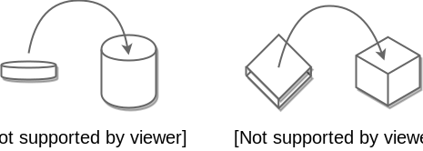

[Generic Programming](https://ko.wikipedia.org/wiki/%EC%A0%9C%EB%84%A4%EB%A6%AD_%ED%94%84%EB%A1%9C%EA%B7%B8%EB%9E%98%EB%B0%8D)은 간단히 정의하기가 쉽진 않은 것 같아요. 하지만 중요한 건, 

> 하나의 값이 여러 다른 데이터 타입들을 가질 수 있는 기술에 중점을 두어 재사용성을 높일 수 있는 프로그래밍 방식

이라는 거겠죠.

### 객체 상속에 의한 제네릭

그런 의미에서 자바는 기본적으로 `java.lang.Object` 를 묵시적 상속 하니까 그냥
제네릭이 가능하다는 얘기가 되네요.
```java
Object obj = new Integer(1);
System.out.println((Integer)obj + 1); // 2
```
이렇게 슈퍼타입 `Object` 에 서브타입 `Integer` 가 할당 되니까 이런식으로 쓰면 되는 거죠.

아, 근데. 저건 좋은 방식은 아녜요.

1. 컴파일 시점(혹은 IDE 를 이용해 작성시점)에 오류 검출이 안되고
2. 코드상에서 실제 데이터의 타입 확인이 안되고 (캡슐화 되어 있는 필드 같은걸로 가정해보면 타입은 `Object` 인데 데이터는 `Integer` 가 들어갔는지 `String` 이 들어가 있는지...🤔)
3. 타입 캐스팅을 하는게 코드가 맘에 들지 않아요.

### 제네릭 표현

그래서 JDK5 부터 제네릭 표현을 쓸 수 있게 되었네요.
```java
List<Integer> list = new ArrayList<Integer>();
list.add(1);
list.add("1"); // error!
...
```


> JDK7 부터는 타입추론이 되니까 `new ArrayList<>()`  이렇게도 작성할 수 있죠.

`List` 가 데이터를 담는 동그란 원형의 통조림 통이라 가정해보면, `List<Square>` 는 네모 모양의 통이라고 생각하면 될 것 같아요.



동그라미는 원형 통에만 들어가고, 네모는 네모난 통에만 들어가는거죠.

### 결론

제네릭을 씁시다!  
코드에서 타입을 추론 할 수 있고, 컴파일 시점의 오류를 일찍 검출해서 Type safe 한 프로그래밍을 할 수 있게 도와주니까요.
