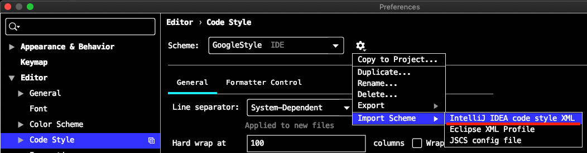

최근에 `클리코딩` 이나 `디자인패턴` 에 다시 관심을 갖고 있어요.  
연차가 어느정도 됐지만 제자리 걸음을 하는 것 같다는 느낌에 기본으로 회기하는 마음이 생겨서요.

여러가지를 접하는 도중에 간과하고 허투로 지나치던 관례중에 **`구문 형식`** 이 중요하단걸 이해 했어요.

> ["코딩 스타일에 대해 논쟁하는 이유"](http://www.mimul.com:80/pebble/default/addTrackBack.action?entry=1559304696070&token=-8812272824716390057) 라는 번역 글에서 이해를 얻었고, 이 글은 ["Why We Argue: Style"](https://www.sandimetz.com/blog/2017/6/1/why-we-argue-style) 를 번역한 내용이라고 하네요.

## IDEA 에 Java Google Style 적용

1. [github 구글 styleguide](https://github.com/google/styleguide) 에서
2. [intellij-java-google-style.xml](https://raw.githubusercontent.com/google/styleguide/gh-pages/intellij-java-google-style.xml) 파일 다운로드하고
3. Preference > Editor > Code Style  
   
4. "Import Scheme" 으로 1에서 다운로드한 파일 선택

## conclusion

개인적으로는 프로젝트 파일로 버전관리를 하거나, 팀원이 공유할 수 있는 위치를 통해서 공동 작업자들이 동시에 활용 할 수 있는 방법을 모색해야만 효과가 있을 것 같네요.

구문 형식의 관례를 지켜야하는 이유가 **코딩은 작성보다 읽는데 더 큰 비용이 발생** 한다는 것을 다시 한번 상기 해봅니다.
